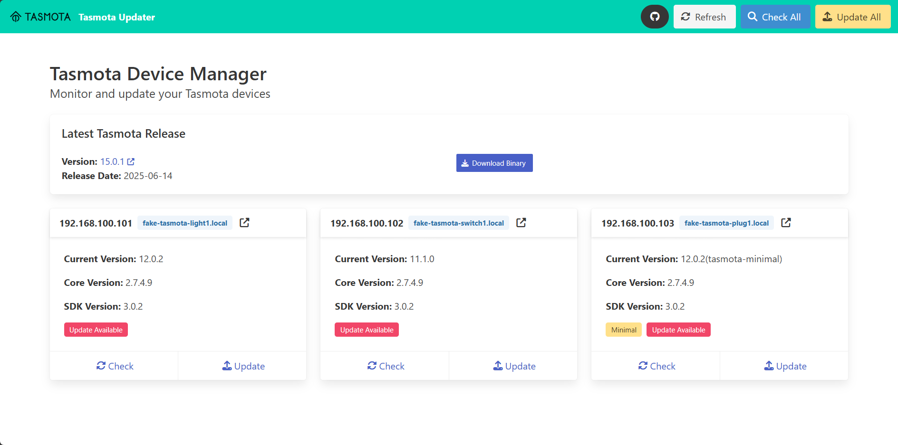

# Tasmota Remote Updater


> Keep your Tasmota devices up to date with a single command or click

[](https://semver.org)
[](https://www.python.org/downloads/)
[](https://opensource.org/licenses/MIT)

Tasmota Remote Updater is a tool that automatically updates multiple Tasmota devices to the latest firmware over your network. No more manual updates or complex scripts - just point it at your devices and let it handle the rest.


## ✨ Features

**Three supported interfaces in one tool:**

- **Web Interface**: Modern dashboard with one-click updates and real-time monitoring, a built-in device editor, and network discovery to find Tasmota devices without hunting for IP addresses
- **RESTful API**: Programmatic access with Swagger documentation
- **Command-Line Interface**: A thin `python -m app.cli` wrapper for cron jobs and scripting — see [Command-Line Usage](docs/cli-usage.md)

## 🚀 Quick Start

### Local Installation

```bash
# Clone the repository
git clone https://github.com/dodjango/tasmota-auto-updater.git
cd tasmota-auto-updater

# Create a virtual environment and install dependencies
python -m venv venv
source venv/bin/activate  # On Windows: venv\Scripts\activate
pip install -r requirements.txt

# Run the web interface
python server.py
```

Then visit http://localhost:5001 in your browser.

### Container Installation

#### Option 1: Build from source

```bash
# Clone the repository and run with Docker or Podman
git clone https://github.com/dodjango/tasmota-auto-updater.git
cd tasmota-auto-updater

# Using Docker
docker compose up -d

# OR using Podman
podman-compose up -d
```

#### Option 2: Pull from container registry

```bash
# Pull from Docker Hub
docker pull dodjango/tasmota-updater:latest
# OR pull from GitHub Container Registry
docker pull ghcr.io/dodjango/tasmota-updater:latest

# Run with Docker
docker run -d -p 5001:5001 \
  -v $(pwd)/config:/app/config \
  -v $(pwd)/logs:/app/logs \
  --name tasmota-updater dodjango/tasmota-updater:latest

# OR run with Podman
podman run -d -p 5001:5001 \
  -v $(pwd)/config:/app/config \
  -v $(pwd)/logs:/app/logs \
  --name tasmota-updater dodjango/tasmota-updater:latest
```

Then visit http://localhost:5001 in your browser.

> **Migrating from an older version?** If you used to bind-mount
> `devices.yaml` directly (`-v $(pwd)/devices.yaml:/app/devices.yaml`), that
> still works, but the web UI's device editor stays read-only — replacing a
> bind-mounted *file* fails with `EBUSY`. Move `devices.yaml` into a directory
> (e.g. `./config/devices.yaml`) and mount that directory instead, as shown
> above, to make the editor writable. The image already looks for the file at
> `/app/config/devices.yaml` by default, so mounting `./config` there — as
> the examples above do — is all that's needed; only set `DEVICES_FILE`
> yourself if you use a different path inside the container.

## 📚 Documentation

- [Installation Guide](docs/installation.md)
- [Command-Line Usage](docs/cli-usage.md)
- [Web Interface Guide](docs/web-interface.md)
- [API Documentation](docs/api.md)
- [Configuration Options](docs/configuration.md)
- [Container Setup](docs/container-setup.md)
- [Development Guide](docs/development.md)
- [Releasing](docs/releasing.md)
- [Troubleshooting](docs/troubleshooting.md)
- [Versioning](#versioning)

## 🤝 Contributing

Contributions are welcome! See our [Contributing Guide](docs/contributing.md) for more details.

## 📄 License

This project is licensed under the MIT License - see the [LICENSE](LICENSE) file for details.

## 🙏 Acknowledgments

- [Tasmota](https://tasmota.github.io/docs/) - For their excellent open-source firmware
- [Flask](https://flask.palletsprojects.com/) - Web framework
- [Gunicorn](https://gunicorn.org/) - WSGI HTTP Server for UNIX
- [Bulma](https://bulma.io/) - CSS framework
- [Alpine.js](https://alpinejs.dev/) - JavaScript framework

## 📋 Versioning

This project follows [Semantic Versioning 2.0.0](https://semver.org/). Version numbers are in the format MAJOR.MINOR.PATCH:

- **MAJOR**: Incompatible API changes
- **MINOR**: Backward-compatible new functionality
- **PATCH**: Backward-compatible bug fixes

You can check the current version via the `/version` API endpoint or by looking at the `app/version.py` file.
