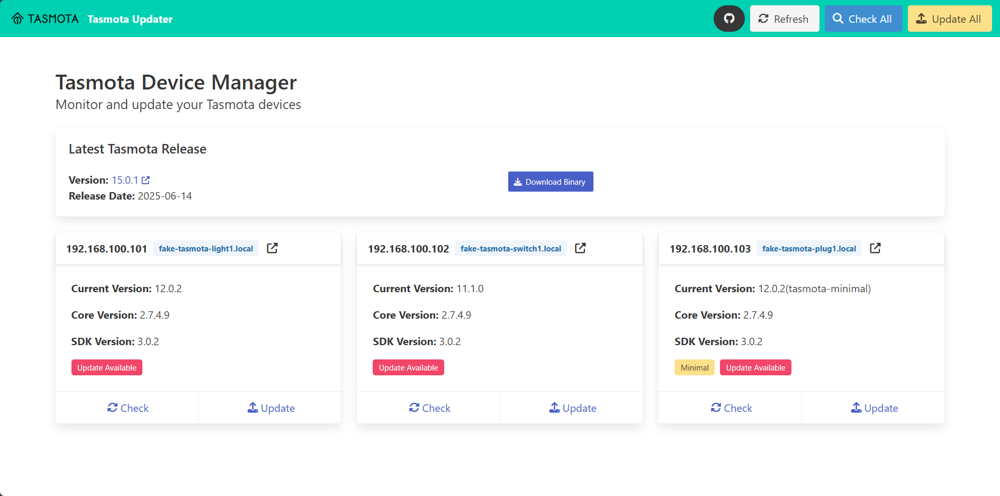

# Tasmota Remote Updater

> Keep your Tasmota devices up to date with a single command or click

Tasmota Remote Updater is a tool that automatically updates multiple Tasmota devices to the latest firmware over your network. No more manual updates or complex scripts - just point it at your devices and let it handle the rest.

## ✨ Features

**Two powerful interfaces in one tool:**

- **Command-Line Interface**: Update multiple devices with a single command
- **Web Interface**: Modern dashboard with one-click updates and real-time monitoring
- **RESTful API**: Programmatic access with Swagger documentation

## Documentation

This documentation will guide you through:

- [Installation](installation.md) - How to install and set up the updater
- [Configuration](configuration.md) - Configure the updater for your environment
- [Web Interface](web-interface.md) - Using the web dashboard
- [CLI Usage](cli-usage.md) - Command-line options and examples
- [API](api.md) - API documentation for developers
- [Container Setup](container-setup.md) - Docker/Podman deployment
- [Development](development.md) - Contributing to the project
- [Troubleshooting](troubleshooting.md) - Common issues and solutions
