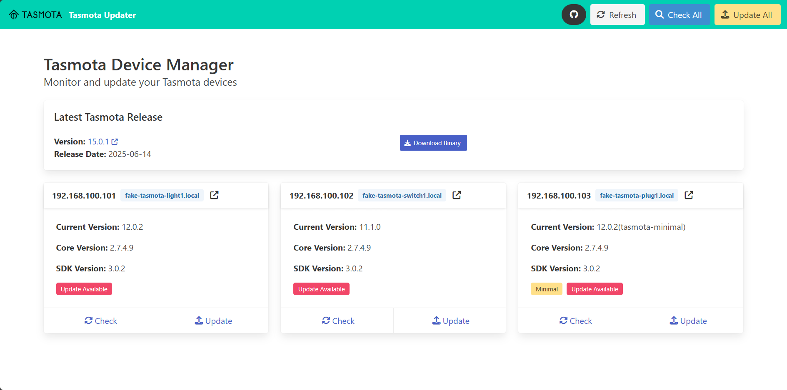

# Web Interface Guide

The Tasmota Remote Updater includes a modern, responsive web interface for managing and updating your Tasmota devices.

## Starting the Web Application

To run the web application:

```bash
# If using a virtual environment, make sure it's activated first
source venv/bin/activate  # For standard venv (bash/zsh)
# OR
source .venv/bin/activate  # For uv (bash/zsh)

# Then run the web application
python server.py
```

The web application will be available at http://localhost:5001

## Interface Overview

The web interface provides a clean, card-based dashboard for managing your Tasmota devices:



### Main Components

1. **Navigation Bar**: Contains the application title and main action buttons
2. **Latest Release Info**: Shows information about the latest Tasmota firmware release
3. **Device Cards**: Each card represents a Tasmota device with its status and actions
4. **Action Buttons**: Buttons for refreshing, checking updates, and updating all devices

## Features

### Device Management

Each device card shows:

- Device IP address and DNS name (if available)
- Current firmware version
- Status indicator (online/offline/updating)
- Update availability indicator
- Individual action buttons

### Device Actions

For each device, you can:

1. **Check Status**: View the current status and firmware version
2. **Check for Updates**: Compare the device's firmware with the latest release
3. **Update Firmware**: Initiate a firmware update for the device
4. **View Details**: See additional information about the device

### Batch Operations

The navigation bar contains buttons for batch operations:

1. **Refresh**: Reload all device information
2. **Check All**: Check for updates on all devices at once
3. **Update All**: Update all outdated devices with one click

### Real-time Feedback

The interface provides real-time feedback during operations:

- Loading indicators show when operations are in progress
- Success and error messages are displayed prominently
- Status indicators update automatically

## API Documentation

The web application includes a comprehensive REST API with Swagger documentation available at http://localhost:5001/apidocs/

The API enables:
- Retrieving device information
- Checking device status
- Fetching latest Tasmota release information
- Performing updates on individual devices
- Batch updating multiple devices

## Configuration

The web interface uses the same `devices.yaml` file as the command-line tool. Any changes made to this file will be reflected in both interfaces.

## Technical Details

The web interface is built with:

- **Backend**: Flask (Python web framework)
- **Frontend**: HTML5, Bulma CSS framework, and Alpine.js
- **API Documentation**: Swagger/OpenAPI

## Next Steps

- [API Documentation](api.md)
- [Configuration Options](configuration.md)
- [Troubleshooting](troubleshooting.md)
